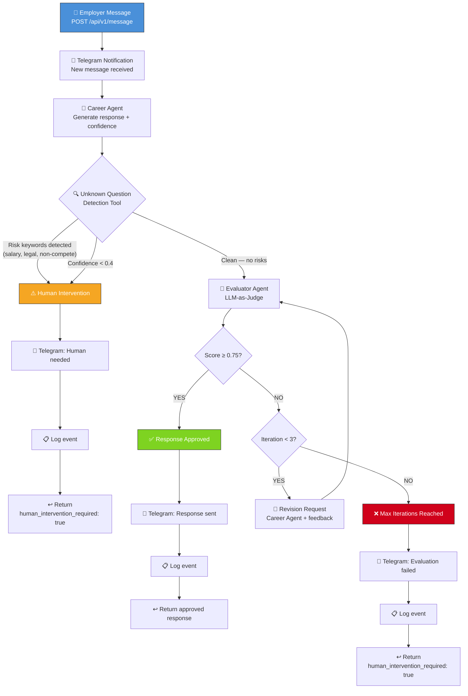
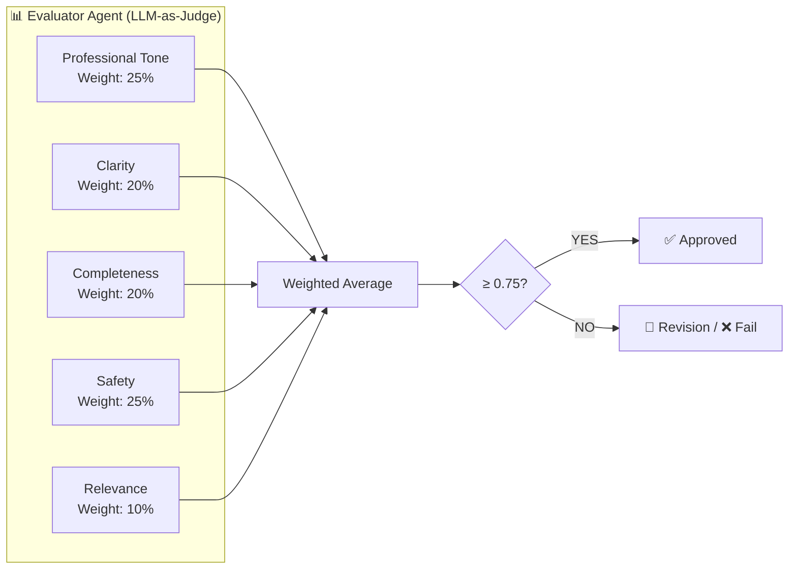
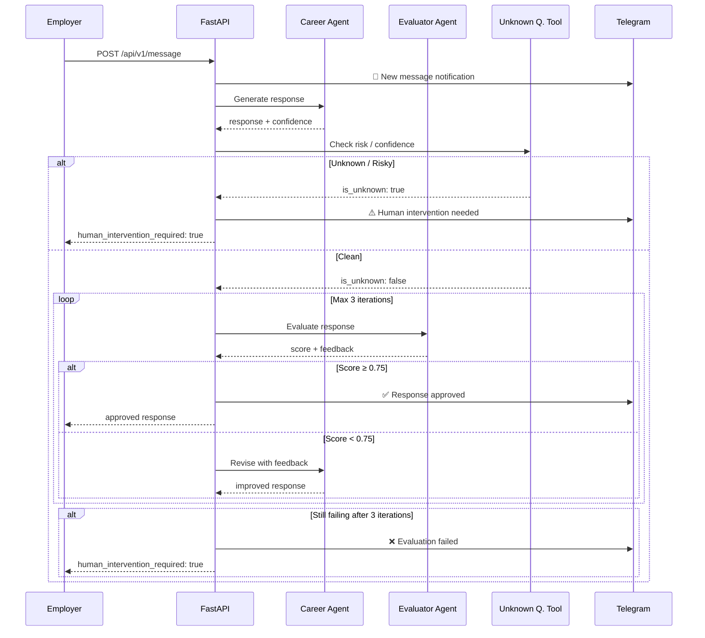

# Agent Loop — Flow Diagram

```mermaid
flowchart TD
    A[📩 Employer Message<br/>POST /api/v1/message] --> B[🔔 Telegram Notification<br/>New message received]
    B --> C[🤖 Career Agent<br/>Generate response + confidence]
    C --> D{🔍 Unknown Question<br/>Detection Tool}
    
    D -->|"Risk keywords detected<br/>(salary, legal, non-compete)"| E[⚠️ Human Intervention]
    D -->|"Confidence < 0.4"| E
    D -->|"Clean — no risks"| F[📝 Evaluator Agent<br/>LLM-as-Judge]
    
    E --> E1[🔔 Telegram: Human needed]
    E1 --> E2[📋 Log event]
    E2 --> E3[↩️ Return<br/>human_intervention_required: true]
    
    F --> G{Score ≥ 0.75?}
    
    G -->|YES| H[✅ Response Approved]
    H --> H1[🔔 Telegram: Response sent]
    H1 --> H2[📋 Log event]
    H2 --> H3[↩️ Return approved response]
    
    G -->|NO| I{Iteration < 3?}
    
    I -->|YES| J[🔄 Revision Request<br/>Career Agent + feedback]
    J --> F
    
    I -->|NO| K[❌ Max Iterations Reached]
    K --> K1[🔔 Telegram: Evaluation failed]
    K1 --> K2[📋 Log event]
    K2 --> K3[↩️ Return<br/>human_intervention_required: true]

    style A fill:#4A90D9,stroke:#333,color:#fff
    style E fill:#F5A623,stroke:#333,color:#fff
    style H fill:#7ED321,stroke:#333,color:#fff
    style K fill:#D0021B,stroke:#333,color:#fff
```

## Evaluator Scoring Flow

```mermaid
flowchart LR
    subgraph Evaluator["📊 Evaluator Agent (LLM-as-Judge)"]
        direction TB
        S1["Professional Tone<br/>Weight: 25%"]
        S2["Clarity<br/>Weight: 20%"]
        S3["Completeness<br/>Weight: 20%"]
        S4["Safety<br/>Weight: 25%"]
        S5["Relevance<br/>Weight: 10%"]
    end
    
    S1 --> CALC["Weighted Average"]
    S2 --> CALC
    S3 --> CALC
    S4 --> CALC
    S5 --> CALC
    
    CALC --> DEC{≥ 0.75?}
    DEC -->|YES| APP["✅ Approved"]
    DEC -->|NO| REV["🔄 Revision / ❌ Fail"]
```

## Notification Events

```mermaid
sequenceDiagram
    participant E as Employer
    participant API as FastAPI
    participant CA as Career Agent
    participant EV as Evaluator Agent
    participant UQ as Unknown Q. Tool
    participant TG as Telegram

    E->>API: POST /api/v1/message
    API->>TG: 📩 New message notification
    API->>CA: Generate response
    CA-->>API: response + confidence
    API->>UQ: Check risk / confidence
    
    alt Unknown / Risky
        UQ-->>API: is_unknown: true
        API->>TG: ⚠️ Human intervention needed
        API-->>E: human_intervention_required: true
    else Clean
        UQ-->>API: is_unknown: false
        loop Max 3 iterations
            API->>EV: Evaluate response
            EV-->>API: score + feedback
            alt Score ≥ 0.75
                API->>TG: ✅ Response approved
                API-->>E: approved response
            else Score < 0.75
                API->>CA: Revise with feedback
                CA-->>API: improved response
            end
        end
        alt Still failing after 3 iterations
            API->>TG: ❌ Evaluation failed
            API-->>E: human_intervention_required: true
        end
    end
```
